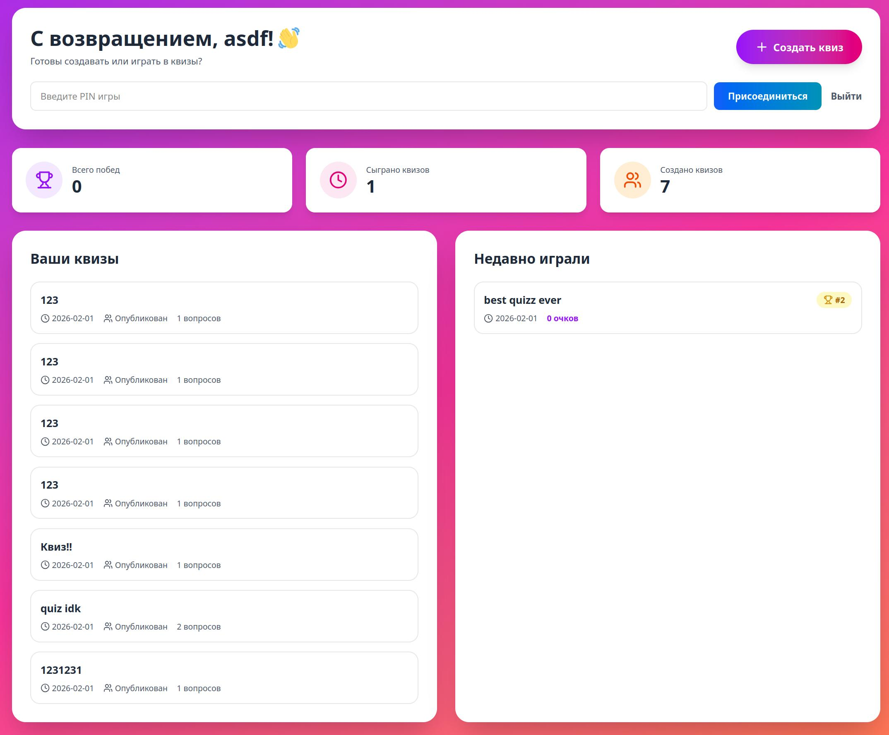
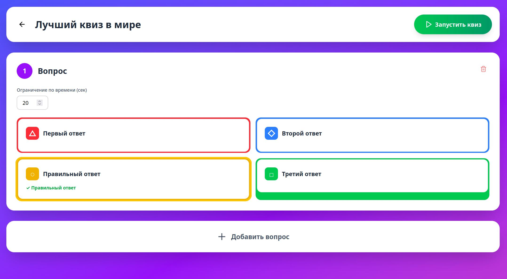
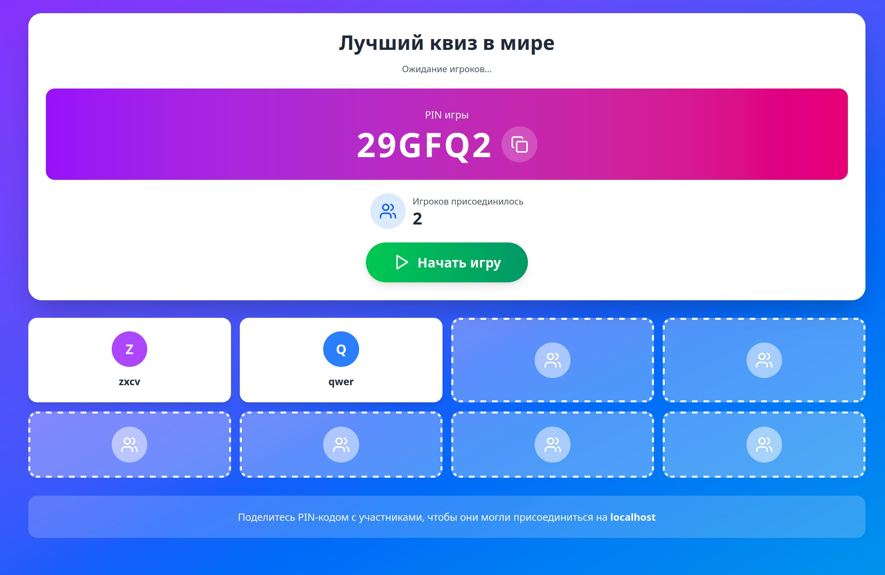
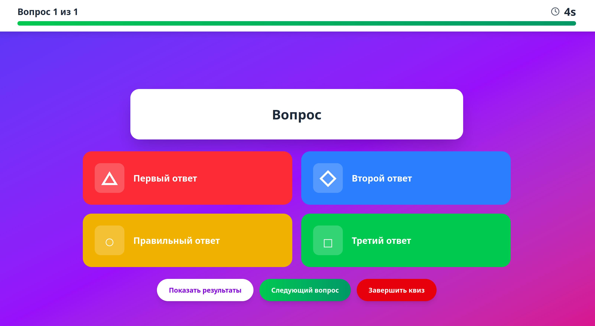
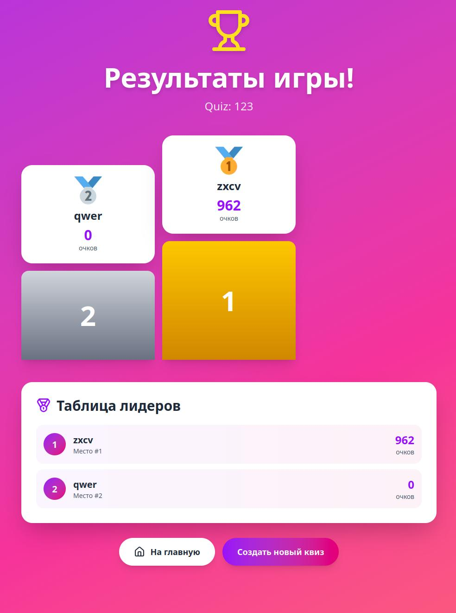

# Tahook

Веб-приложение для проведения квизов, включающее в себя следующие функции:

- Регистрация и авторизация пользователей — участников и организаторов
- Создание и настройка квизов: выбор категорий вопросов, настройка времени и правил проведения
- Возможность добавления организатором вопросов разных типов: текстовых и в виде изображения, содиночным и множественным выбором ответа  
- Функция запуска опроса с возможностью подключения участников к текущему квизу по коду комнаты. Каждое задание квиза отображается в режиме реального времени для всех участников и доступно для ответа только во время его демонстрации
- Система подсчёта баллов и определения победителей
- Личный кабинет для участников и организаторов с историей участия и проведённых квизов 

[Ссылка на макет](https://www.figma.com/make/yEcvZ9FPi9VLy0HK34xHKn/Kahoot-like-Quiz-Website-Layout?p=f)

Как выглядит приложение

